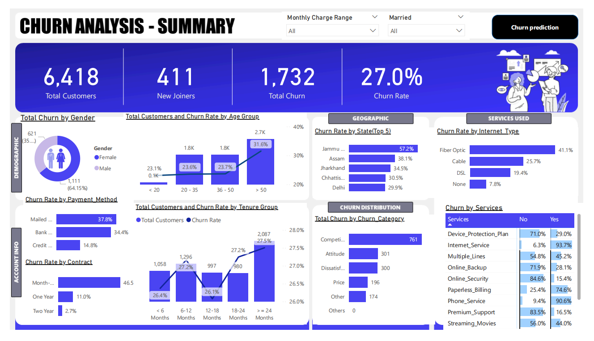
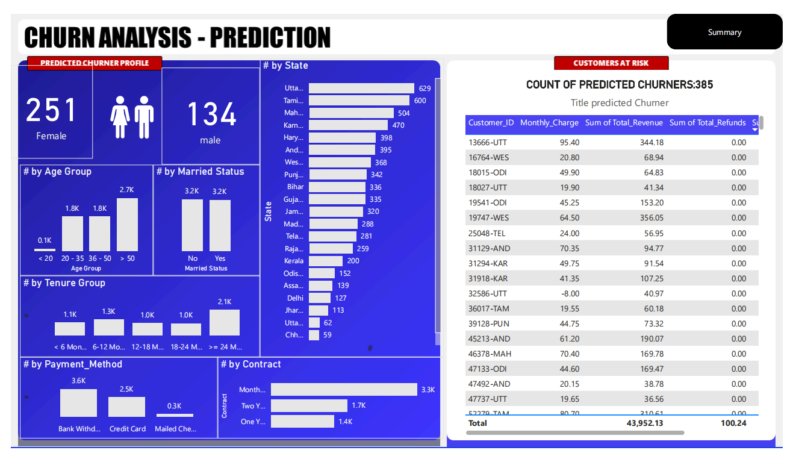

# 📊 Telecom Customer Churn Analysis | Power BI + SQL + Machine Learning

This end-to-end project focuses on **analyzing and predicting customer churn** for a telecom company using **Power BI, SQL Server, and Python**. The goal is to identify customers at risk of leaving and support proactive retention strategies.

---

## Table of Contents
- [Project Overview](#project-overview)
- [Data Source](#data-source)
- [Tools & Tech Stack](#tools--tech-stack)
- [ETL & Data Preparation](#etl--data-preparation)
- [Exploratory Data Analysis (EDA)](#exploratory-data-analysis-eda)
- [Power BI Dashboards](#power-bi-dashboards)
- [Machine Learning Model](#machine-learning-model)
- [Key Findings](#key-findings)
- [Recommendations](#recommendations)
- [Limitations](#limitations)
- [References](#references)

---

## 📝 Project Overview

Developed a machine learning model to predict customer churn for a telecom company, enabling data-driven customer retention efforts. The project involved:

- Exploratory Data Analysis (EDA)
- Feature engineering
- SQL-based ETL
- Building predictive models in Python
- Visualizing insights and predictions in Power BI

---

## 📂 Data Source

- **Filename:** `Customer_Data.xls`
- **Details:** Contains customer demographics, service subscriptions, billing details, contract types, and churn labels.

---

## 🛠️ Tools & Tech Stack

- **SQL Server** – ETL and transformation logic
- **Power BI** – Dashboard creation and data visualization
- **Python (Jupyter Notebook)** – Machine learning model development using:
  - `pandas`
  - `seaborn`
  - `scikit-learn`

---

## 🔄 ETL & Data Preparation

### In SQL Server:
- Joined and transformed raw tables
- Cleaned data (missing values, duplicates, inconsistent formats)
- Applied business rules to enhance reliability
- Loaded processed data into reporting-ready views

### In Power BI:
- Used Power Query for final data shaping
- Created calculated columns and DAX measures for visual analytics

---

## 🔍 Exploratory Data Analysis (EDA)

Performed EDA in Python to answer key business questions:

- Which customers are most likely to churn?
- What impact do contract types, internet service, and tenure have on churn?
- How do payment methods influence churn behavior?

---

## 📊 Power BI Dashboards

### ✅ Churn Summary Dashboard

This dashboard visualizes key churn metrics across customer segments including gender, age group, contract type, tenure, payment method, and more.

---

### 🤖 Prediction Dashboard

This dashboard highlights predicted churners by risk category, state, tenure, payment type, and contract, helping the business proactively retain customers.

---

## 🤖 Machine Learning Model

- Built a **Random Forest Classifier** in Python
- Process:
  - Data cleaning & encoding
  - Feature selection & engineering
  - Train-test split
  - Hyperparameter tuning

### 🧪 Model Metrics:
- **Accuracy:** ~85%
- **ROC-AUC:** 0.90

Predicted high-risk churners were exported and visualized in Power BI.

---

## 📌 Key Findings

- **Overall churn rate:** 27%
- Highest churn observed in:
  - **Month-to-month** contracts (46.5%)
  - **Fiber Optic** users (41.1%)
  - **Mailed Check** payment method (37.8%)
- Customers with **> 24 months tenure** had much lower churn
- Short-tenure customers and those with **high monthly charges** are more likely to churn

---

## ✅ Recommendations

- Target **month-to-month** users with loyalty offers
- Promote **annual or two-year** contracts to increase retention
- Offer personalized discounts to customers with **high monthly charges**
- Focus on customers in **early tenure stages** for onboarding and engagement
- Use model predictions to build **automated churn prevention workflows**

---

## ⚠️ Limitations

- Missing or imputed values may slightly reduce model accuracy
- External market trends (e.g. competition) not included in data
- Model performance may decline over time without retraining
- Outliers in billing and tenure metrics require ongoing monitoring

---

## 📚 References

- [Scikit-learn Documentation](https://scikit-learn.org/stable/)
- [Power BI Docs](https://learn.microsoft.com/en-us/power-bi/)
- [SQL Server Docs](https://learn.microsoft.com/en-us/sql/)
- Stack Overflow – Troubleshooting and best practices

---

## 🔗 GitHub Repository

> 📌 [Project Link](https://github.com/divyadharshiniv22/Telcom-Customer-Churn-Analysis/tree/feature/v1)

